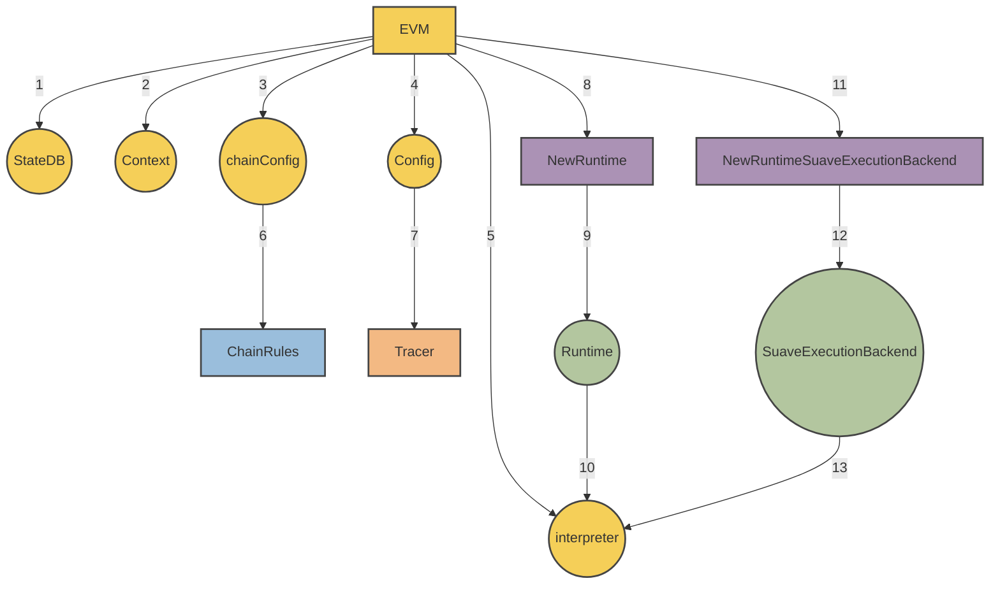

# MEVM

SUAVE uses the **MEVM**, which is a modified EVM with new precompiles for MEV use cases. This gives anyone the power to program MEV applications as smart contracts within an expressive, familiar, and flexible programming environment - just like the normal EVM. 

The MEVM offers every primitive of the MEV supply chain as a precompile, allowing any centralized MEV infrastructure to be transformed into a smart contract running on SUAVE.

For a high level description of the goals of the MEVM, we encourage you to read [this post](https://writings.flashbots.net/mevm-suave-centauri-and-beyond). On this page, we'll be diving deep into the technical implementation.

## Architecture

Our goal is to give you what you need to write more expressive smart contracts and conduct confidential computation, such that you can build any kind of MEV application.

For this part, if you remember the below formula, you're good to go:

**SuaveExecutionBackend 🤝 EVM = MEVM**

Here is a visual overview of what the above actually looks like:



What do you get from the **SuaveExecutionBackend** that we've married to the EVM through the new runtime? In a nutshell: [3 new API endpoints](/reference/confidential-computation#apis):

```go
func NewRuntimeSuaveExecutionBackend(evm *EVM, caller common.Address) *SuaveExecutionBackend {
	if !evm.Config.IsOffchain {
		return nil
	}

	return &SuaveExecutionBackend{
		ConfidentialStoreBackend: evm.suaveExecutionBackend.ConfidentialStoreBackend,
		MempoolBackend:           evm.suaveExecutionBackend.MempoolBackend,
		OffchainEthBackend:       evm.suaveExecutionBackend.OffchainEthBackend,
		confidentialInputs:       evm.suaveExecutionBackend.confidentialInputs,
		callerStack:              append(evm.suaveExecutionBackend.callerStack, &caller),
	}
}
```

Each of these new APIs - `ConfidentialStoreBackend`, `MempoolBackend`, `OffchainEthBackend` - are available in any solidity smart contract through the use of [precompiles](/reference/precompiles). The precompiles also make use of `callerStack` to specify whether there is confidential computation required, and `confidentialInputs` to specify the inputs to that computation if it is required.

## Notable differences from go-ethereum

### Changes to RPC methods

1. New `IsOffchain` and `ExecutionNode` fields have been added to TransactionArgs, used in `eth_sendTransaction` and `eth_call` methods.
    - If `IsOffchain` is set to true, the call will be performed confidentially, using the `ExecutionNode` passed in for constructing `OffchainTx`.

2. New, optional `confidential_data` argument has been added to `eth_sendRawTransaction`, `eth_sendTransaction` and `eth_call` methods.
    - The confidential data is made available to the EVM in the confidential mode via a precompile, but does not become a part of the eventual on-chain transaction. This enables confidential computation (like simulating a bundle, putting the data into confidential store).

### SuavePrecompiledContract

We introduce a new interface [SuavePrecompiledContract](https://github.com/flashbots/suave-geth/blob/main/core/vm/contracts.go) for SUAVE precompiles.

```go
type SuavePrecompiledContract interface {
	PrecompiledContract
	RunOffchain(backend *SuaveExecutionBackend, input []byte) ([]byte, error)
}
```

The method `RunOffchain` is invoked during confidential execution, and the `SuaveExecutionBackend` which provides access to confidential compute APIs is passed in as input.

### SuavePrecompiledContractWrapper

We introduce [SuavePrecompiledContractWrapper](https://github.com/flashbots/suave-geth/blob/main/core/vm/suave.go) implementing the `PrecompiledContract` interface. The new structure captures the confidential compute APIs in its constructor, and passes the confidential compute APIs during the usual contract's `Run` method to a separate method: `RunOffchain`.

### SuaveExecutionBackend

We introduce [SuaveExecutionBackend](https://github.com/flashbots/suave-geth/blob/main/core/vm/suave.go), which enables off-chain compute and confidential execution:

1. Access to off-chain APIs
2. Access to confidential input
3. Caller stack tracing

### EVM Interpreter

The [EVM interpreter](https://github.com/flashbots/suave-geth/blob/main/core/vm/interpreter.go) is modified to enable confidential computation:

1. We introduce `IsOffchain` to the interpreter's config
2. We modify the `Run` function to accept off-chain APIs `func (in *EVMInterpreter) Run(*SuaveExecutionBackend, *Contract, []byte, bool) ([]byte, err)`
3. We modify the `Run` function to trace the caller stack

Like `eth_sendTransaction`, this method accepts an additional, optional confidential inputs argument.

### Basic Eth block building RPC

We implement two rpc methods that allow building Ethereum blocks from a list of either transactions or bundles: `BuildEth2Block` and `BuildEth2BlockFromBundles`.

These methods are defined in [BlockChainAPI](https://github.com/flashbots/suave-geth/blob/main/internal/ethapi/api.go)

```go
func (s *BlockChainAPI) BuildEth2Block(ctx context.Context, buildArgs *types.BuildBlockArgs, txs types.Transactions) (*engine.ExecutionPayloadEnvelope, error)
func (s *BlockChainAPI) BuildEth2BlockFromBundles(ctx context.Context, buildArgs *types.BuildBlockArgs, bundles []types.SBundle) (*engine.ExecutionPayloadEnvelope, error)

```

The methods are implemented in [worker](https://github.com/flashbots/suave-geth/blob/main/miner/worker.go), by `buildBlockFromTxs` and `buildBlockFromBundles` respectively.

`buildBlockFromTxs` will build a block out of the transactions provided, while `buildBlockFromBundles` will - in addition - forward the block profit to the requested fee recipient, as needed for boost relay payments.
