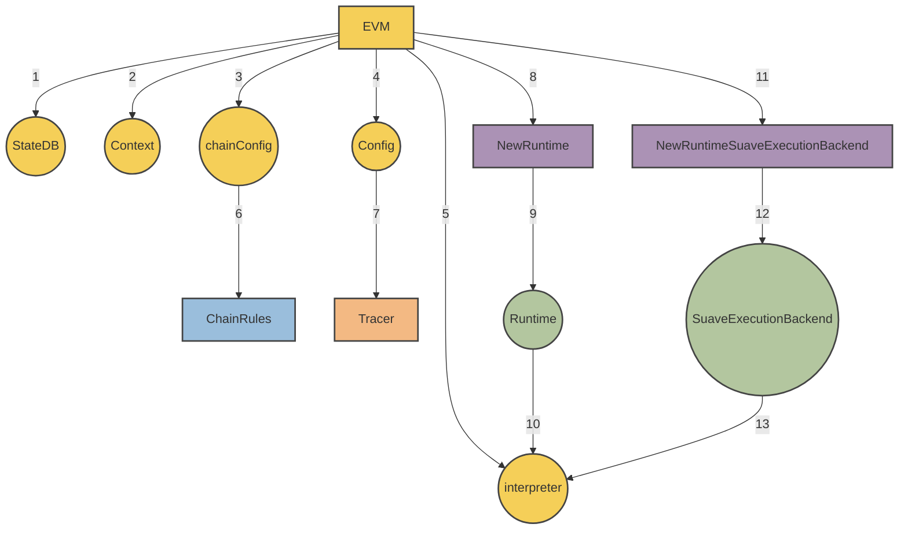

# MEVM

SUAVE uses the **MEVM**, which is a modified EVM with new precompiles for MEV use cases. This gives anyone the power to program MEV applications as smart contracts within an expressive, familiar, and flexible programming environment - just like the normal EVM. 

The MEVM offers every primitive of the MEV supply chain as a precompile, allowing any centralized MEV infrastructure to be transformed into a smart contract running on SUAVE.

For a high level description of the goals of the MEVM, we encourage you to read [this post](https://writings.flashbots.net/mevm-suave-centauri-and-beyond). On this page, we'll be diving deep into the technical implementation.

## Architecture

Our goal is to give you what you need to write more expressive smart contracts and conduct confidential computation, such that you can build any kind of MEV application.

For this part, if you remember the below formula, you're good to go:

**SuaveExecutionBackend 🤝 EVM = MEVM**

Here is a visual overview of what the above actually looks like:



What do you get from the **SuaveExecutionBackend** that we've married to the EVM through the new runtime? In a nutshell: 3 new API endpoints:

```go
func NewRuntimeSuaveExecutionBackend(evm *EVM, caller common.Address) *SuaveExecutionBackend {
	if !evm.Config.IsOffchain {
		return nil
	}

	return &SuaveExecutionBackend{
		ConfidentialStoreBackend: evm.suaveExecutionBackend.ConfidentialStoreBackend,
		MempoolBackend:           evm.suaveExecutionBackend.MempoolBackend,
		OffchainEthBackend:       evm.suaveExecutionBackend.OffchainEthBackend,
		confidentialInputs:       evm.suaveExecutionBackend.confidentialInputs,
		callerStack:              append(evm.suaveExecutionBackend.callerStack, &caller),
	}
}
```

Each of these new APIs - `ConfidentialStoreBackend`, `MempoolBackend`, `OffchainEthBackend` - are available in any solidity smart contract through the use of [precompiles](/reference/precompiles). The precompiles also make use of `callerStack` to specify whether there is confidential computation required, and `confidentialInputs` to specify the inputs to that computation if it is required.

## Confidential Compute APIs

### ConfidentialStoreBackend

The Confidential Store is an integral part of the SUAVE chain, designed to facilitate secure and privacy-preserving transactions and smart contract interactions. It is a key-value store where users can safely store and retrieve confidential data related to their bids. The Confidential Store restricts access (both read and write) to the allowed peekers of each bid, allowing developers to define the entire data model of their application.

The current implementation of `ConfidentialStoreBackend` is managed by the `LocalConfidentialStore` struct. It provides thread-safe access to the bids' confidential data.

```go
type ConfidentialStoreBackend interface {
    Initialize(bid Bid, key string, value []byte) (Bid, error)
    Store(bidId BidId, caller common.Address, key string, value []byte) (Bid, error)
    Retrieve(bid BidId, caller common.Address, key string) ([]byte, error)
}
```

The `LocalConfidentialStore` provides the following methods:

1. **Initialize**: This method is used to initialize a bid with a given `bid.Id`. If no `bid.Id` is provided, a new one is created. The method is trusted, meaning it is not directly accessible through precompiles.
2. **Store**: This method stores a given value under a specified key in a bid's `dataMap`. Access is restricted only to addresses listed in the bid's `AllowedPeekers`.
3. **Retrieve**: This method retrieves data associated with a given key from a bid's `dataMap`. Similar to the `Store` method, access is restricted only to addresses listed in the bid's `AllowedPeekers`.

Please note that the actual implementation of the Confidential Store will vary depending on future requirements and the privacy mechanisms used.

### MempoolBackend

The SUAVE mempool is a temporary storage pool for transactions waiting to be added to SUAVE. This mempool, `MempoolOnConfidentialStore`, operates on the Confidential Store, hence facilitating the privacy-preserving handling of bid transactions. The `MempoolOnConfidentialStore` is designed to handle SUAVE bids, namely the submission, retrieval, and grouping of bids by decryption condition such as block number and protocol. It provides a secure and efficient mechanism for managing these transactions while preserving their confidentiality.

The current implementation of `MempoolBackend` is managed by the `MempoolOnConfidentialStore` struct, which interacts directly with the `ConfidentialStoreBackend` interface.

```go
type MempoolBackend interface {
    SubmitBid(Bid) error
    FetchBidById(BidId) (Bid, error)
    FetchBidsByProtocolAndBlock(blockNumber uint64, namespace string) []Bid
}
```

The `MempoolOnConfidentialStore` provides the following methods:

1. **SubmitBid**: This method submits a bid to the mempool. The bid is stored in the Confidential Store with its ID as the key. Additionally, the bid is grouped by block number and protocol, which are also stored in the Confidential Store.
2. **FetchBidById**: This method retrieves a bid from the mempool using its ID.
3. **FetchBidsByProtocolAndBlock**: This method fetches all bids from a particular block that match a specified protocol.

The mempool operates on the underlying Confidential Store, thereby maintaining the confidentiality of the bids throughout the transaction process. As such, all data access is subject to the Confidential Store's security controls, ensuring privacy and integrity. 

Please note that while this initial implementation provides an idea of the ideal functionality, the final version will most likely incorporate additional features or modifications.

### OffchainEthBackend

```go
type OffchainEthBackend interface {
    BuildEthBlock(ctx context.Context, args *BuildBlockArgs, txs types.Transactions) (*engine.ExecutionPayloadEnvelope, error)
    BuildEthBlockFromBundles(ctx context.Context, args *BuildBlockArgs, bundles []types.SBundle) (*engine.ExecutionPayloadEnvelope, error)
}
```