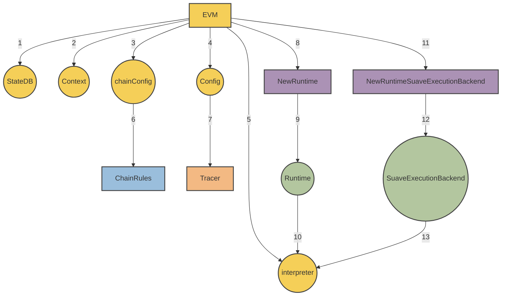

import AlignItems from "@site/src/components/AlignItems/AlignItems.tsx"

# MEVM

The MEVM seeks to offer every primitive of the MEV supply chain as a precompile, allowing any centralized MEV infrastructure to be transformed into a smart contract running on SUAVE.

For a high level description of the goals of the MEVM, we encourage you to read [this post](https://writings.flashbots.net/mevm-suave-centauri-and-beyond). On this page, we'll be diving deep into the technical implementation.

If you'd prefer to learn by running it yourself, please follow [this guide](/how-to/run-suave).

## Architecture

Our goal is to give you what you need to write more expressive [builder solidity](/technical-details/builder-solidity/index) and conduct [confidential computation](/technical-details/confidential-computation/index), such that you can build any kind of MEV application.

If you've read the two links above, you'll know that the basic flow of a transaction on SUAVE looks like this:

<AlignItems horizontal="center" vertical="center" sideMargin={0}>
<div>
  
</div>
</AlignItems>

How do we achieve this "Confidential MEVM execution"? 

At a high level, we have adapted the `eth_sendRawTransaction` RPC method to accept an additional field, called `confidential_data`. Users place signed transactions from other blockchains in this field. They encrypt the field for specific SUAVE node(s), and specify some builder solidity contract on SUAVE, which holds the logic for what to do with their encrypted inputs.

When a SUAVE node receives a `RawTransaction`, it checks whether there are confidential inputs. If there are, we call this a `confidentialComputeRequest` and the MEVM kicks into action. It enters the function being called in the builder solidity contract and, using a `view` function and the `confidentalInputs` [precompile](/technical-details/precompiles), gets the data it needs about the user's transaction on another blockchain. The MEVM computes some result and stores the relevant data locally, in its `confidentialDataStore`. This does not permute state, as we're only using a `view` function fetch data and then doing the computation locally, in the MEVM.

Computation complete, the MEVM places what we call the `confidentialComputeResult` in the original `RawTransaction` it received, which it then propagates to the public mempool. The `confidentialComputeResult` is really a callback to another function, which does permute state and often emits some kind of event, the logs of which hold data required by others parties without revealing the original inputs. We encourage you to read about [mev-share on SUAVE](/technical-details/builder-solidity/worked-examples/mev-share) for a practical example. 

For now, it is good enough that you understand that all our adaptations to the EVM serve the goal of confidential computation, as outlined above. These changes can be summed up in a very simple formula:

> **SuaveExecutionBackend + EVM = MEVM**

Here is a visual overview of what that actually means in practice:



In words: the EVM is made up of a whole bunch of different parts. Those numbered `1` through `7` exist in the vanilla EVM we all know and love. Parts `8` through `13` are what we have added (or adapted in the case of the `interpreter`) in order to enable confidential computation.

What do you get from the [SuaveExecutionBackend](https://github.com/flashbots/suave-geth/blob/main/core/vm/suave.go) that we've married to the EVM through the new runtime? 

In a nutshell: [3 new API endpoints](/technical-details/confidential-computation/apis):

```go
func NewRuntimeSuaveExecutionBackend(evm *EVM, caller common.Address) *SuaveExecutionBackend {
	if !evm.Config.IsConfidential {
		return nil
	}

	return &SuaveExecutionBackend{
		ConfidentialStoreBackend: evm.suaveExecutionBackend.ConfidentialStoreBackend,
		MempoolBackend:           evm.suaveExecutionBackend.MempoolBackend,
		ConfidentialEthBackend:   evm.suaveExecutionBackend.ConfidentialEthBackend,
		confidentialInputs:       evm.suaveExecutionBackend.confidentialInputs,
		callerStack:              append(evm.suaveExecutionBackend.callerStack, &caller),
	}
}
```

Each of these new APIs - `ConfidentialStoreBackend`, `MempoolBackend`, `ConfidentialEthBackend` - are available in [builder solidity](/technical-details/builder-solidity/index) through the use of [precompiles](/technical-details/precompiles). The precompiles also make use of `confidentialInputs` to specify the data relevant to confidential computation, and `callerStack` enables transaction tracing.

## Notable differences from go-ethereum

### Changes to RPC methods

1. New `IsConfidential` and `ExecutionNode` fields are added to the TransactionArgs used in `eth_sendTransaction` and `eth_call` methods.
    - If `IsConfidential` is set to true, the call will be performed as a confidential call, using the SUAVE node passed in for constructing `ConfidentialComputeRequest`.
    - `SuaveTransaction` is the result of `eth_sendTransaction`.

2. New optional argument - `confidential_data` is added to `eth_sendRawTransaction`, `eth_sendTransaction` and `eth_call` methods.
    - The confidential data is made available to the EVM in the confidential mode via a precompile, but does not become a part of the transaction that makes it to chain. This allows performing computation based on confidential data (like simulating a bundle, or putting the data into confidential store).

### SuavePrecompiledContract

We introduce a new interface [SuavePrecompiledContract](https://github.com/flashbots/suave-geth/blob/main/core/vm/contracts.go) for SUAVE precompiles.

```go
type SuavePrecompiledContract interface {
	PrecompiledContract
	RunConfidential(backend *SuaveExecutionBackend, input []byte) ([]byte, error)
}
```

The method `RunConfidential` is invoked during confidential execution, and the suave execution backend which provides access to confidential APIs is passed in as input.

### SUAVE Precompile Wrapper

We introduce [SuavePrecompiledContractWrapper](https://github.com/flashbots/suave-geth/blob/main/core/vm/suave.go) implementing the `PrecompiledContract` interface. The new structure captures the confidential APIs in its constructor, and passes the confidential APIs during the usual contract's `Run` method to a separate method - `RunConfidential`.

### SuaveExecutionBackend

We introduce [SuaveExecutionBackend](https://github.com/flashbots/suave-geth/blob/main/core/vm/suave.go), which enables off-chain compute and confidential execution:

1. Access to off-chain APIs
2. Access to confidential input
3. Caller stack tracing

### EVM Interpreter

The [EVM interpreter](https://github.com/flashbots/suave-geth/blob/main/core/vm/interpreter.go) is modified to enable confidential computation:

* We introduce `IsConfidential` to the interpreter's config
* We modify the `Run` function to accept confidential APIs `func (in *EVMInterpreter) Run(*SuaveExecutionBackend, *Contract, []byte, bool) ([]byte, err)`
* We modify the `Run` function to trace the caller stack

Like `eth_sendTransaction`, this method accepts an additional, optional confidential inputs argument.

### Basic Eth block building RPC

We implement two rpc methods that allow building Ethereum blocks from a list of either transactions or bundles: `BuildEth2Block` and `BuildEth2BlockFromBundles`.

These methods are defined in [BlockChainAPI](https://github.com/flashbots/suave-geth/blob/main/internal/ethapi/api.go)

```go
func (s *BlockChainAPI) BuildEth2Block(ctx context.Context, buildArgs *types.BuildBlockArgs, txs types.Transactions) (*engine.ExecutionPayloadEnvelope, error)
func (s *BlockChainAPI) BuildEth2BlockFromBundles(ctx context.Context, buildArgs *types.BuildBlockArgs, bundles []types.SBundle) (*engine.ExecutionPayloadEnvelope, error)

```

The methods are implemented in [worker](https://github.com/flashbots/suave-geth/blob/main/miner/worker.go), by `buildBlockFromTxs` and `buildBlockFromBundles` respectively.

`buildBlockFromTxs` will build a block out of the transactions provided, while `buildBlockFromBundles` will - in addition - forward the block profit to the requested fee recipient, as needed for boost relay payments.
